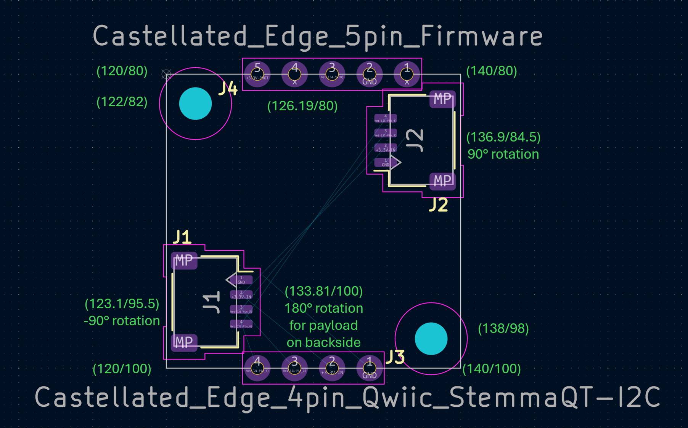
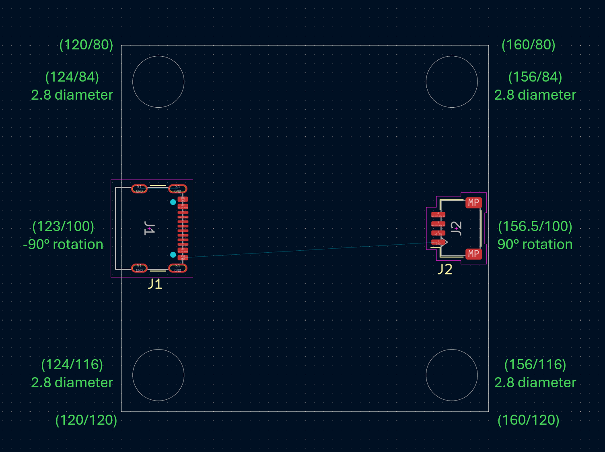

# PCB Mechanical Guidelines

These guidelines define the physical standards for noknok PCBs, including module dimensions, mounting holes, connector clearances, and mechanical tolerances.
They ensure that all modules remain compatible with housings, standoffs, and other modules.

---

## 1. Standard PCB Sizes

To ensure consistency and predictable enclosure design, modules should follow these standard sizes:

- **20 × 20 mm** — ultra-compact modules (simple sensors, I2C devices)
  - (120/80) - (140/100) in KiCad PCB Design
  - Two **M2.5 mounting holes, Ø2.5 mm NPTH**, at diagonal corners: KiCad **(122.25/82.25)** and **(137.75/97.75)** = **2.25 mm from each corner**
  - One corner hole carries the flashing pads via `noknok_FlashPads_I2C-module_1x3_M2.5` (oriented so the pads project inward); the other corner uses `noknok_MountingHole_2.5mm_M2.5`
  - **No castellated edges** — the old 5-pin flashing edge and 4-pin I2C edge have been removed (unreliable to contact). I2C is via the JST-SH connectors.
  - JST 4-pin I2C connectors (123.1/95.5 at -90° rotation) and (136.9/84.5 at 90° rotation)
  
  > Note: the diagram above predates the V2 change (castellated edges → bottom-side pogo flash pads + M2.5 holes) and will be refreshed.
- **40 × 40 mm** — USB-C modules (audio, motor drivers, connectivity)
  - (120/80) - (160/120) in KiCad PCB Design
  - Four **M2.5 mounting holes, Ø2.5 mm NPTH**, at (124/84), (156/84), (124/116) and (156/116)
  - Flashing: USB modules use 2-wire SWD → the 4-pad variant `noknok_FlashPads_USB-module_1x4_M2.5` (planned)
  - downstream JST 4-pin I2C connector (156.5/100 at 90° rotation)
  - USB connector (123/100 at -90° rotation)
  
- **40 × 60 mm** — larger modules (USB Hub, USB Power, etc.)

For standardized noknok modules, any other dimensions should increase size by increments of 1cm.
i.e. please do not use e.g. 2.53cm x 1.48cm dimensions. Instead go for full centimeters: 1x1cm, 1x4cm, 5x8cm, etc.
This facilitates 3D housing design.

---

## 2. Mounting Holes & Fasteners

### **Fastener: M2.5 (ecosystem-wide)**
noknok standardizes on **M2.5** for every module — one screw size across the whole ecosystem.
- **Why M2.5:** noknok is Qwiic / Stemma QT compatible, and the Adafruit/SparkFun de-facto standard is M2.5. Standardizing on it lets users reuse the ubiquitous **M2.5 nylon screw + hex standoff kits** (e.g. **[Adafruit 3299](https://www.adafruit.com/product/3299)**).
- **Hardware:** prefer **M2.5 nylon** screws + standoffs (non-conductive → no short risk near pads or traces). Metal M2.5 is tolerated.
- **Hole diameter:** noknok uses **2.5 mm** (matching Adafruit's holes and the nylon kit), rather than the 2.7 mm ISO close-fit clearance. 2.5 mm also keeps the hole tight enough to act as a flashing-jig locator. (Reference ISO 273 close fit: M2 = 2.2, M2.5 = 2.7, M3 = 3.2 mm.)

### **Hole spec & placement**
- **Ø2.5 mm, NPTH (non-plated), no annular ring.** Mechanical only — no electrical connection.
- **Two holes per board, diagonally opposite corners** (maximum spread = best resistance to twist/flex when connectors are plugged/unplugged).
- **Standard placement: hole center 2.25 mm from each board edge** = (2.25, 2.25) mm from the corner, on the 20 × 20 I2C modules. This is set by the most space-constrained board (the LED button) and used on all three I2C modules for one consistent pattern + one flashing jig. **3 mm is preferred where space allows** (larger boards) so the standoff fully lands.
- **Courtyard: 2.8 mm radius**, sized to the M2.5 head / standoff (~5 mm; 4.5 mm across flats, ~5.2 mm across corners) — not to the hole. At 2.25 mm placement the courtyard spills ~0.55 mm past the edge and the nylon head/standoff overhangs the corner by ~0.25 mm: cosmetic and acceptable for light, nylon-mounted modules. **Do not place a hole center closer than 2.25 mm to an edge.**

### **noknok footprints** (in `electrical/noknok.pretty/`, library nickname `noknok`)
- **`noknok_MountingHole_2.5mm_M2.5`** — the plain second mounting hole.
- **`noknok_FlashPads_I2C-module_1x3_M2.5`** — the first mounting hole *with the flashing pads embedded* at a fixed offset; doubles as the flashing interface and orientation key (see [Electrical guidelines §6](../electrical/readme.md)). Both footprints share the same Ø2.5 mm hole and 2.8 mm courtyard.

### **Routing & assembly notes**
- The courtyard is a **component-placement** keep-out, not a routing keep-out. Traces and **soldermask-covered** copper may pass under the screw head / standoff — only keep **exposed** copper (pads) out from under the clamp area.
- With NPTH holes and nylon hardware there is no short risk under the head/standoff. The flashing footprint additionally keeps ~0.6 mm copper-to-standoff clearance so even a metal head/standoff won't touch exposed pad copper.
- Flash modules **before** final assembly — the jig's locating post needs the mounting hole free of a screw.

---

## 3. Safety & Responsibility Disclaimer

The mechanical guidelines described in this document are intended to support reproducible, modular, and maker-friendly designs within the noknok ecosystem. They do **not** replace professional engineering judgment.

By using these guidelines, you acknowledge that:

- You are responsible for ensuring **electrical safety**, **mechanical safety**, and **structural integrity** of your designs.  
- You must verify that your modules, housings, and assemblies comply with relevant **local regulations**, **material limitations**, and **use-case requirements**.  
- noknok and its contributors are not liable for damages resulting from improper design, manufacturing, or use of modules or housings.

These guidelines are provided **as-is** to support creativity and reproducibility in the community.
